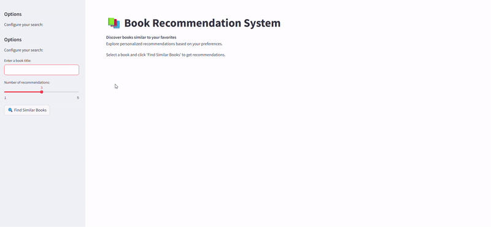

# Book Recommendation System 📚

Welcome to the **Book Recommendation System** repository! This project leverages natural language processing and machine learning to recommend books based on their descriptions and embeddings.


---

## 🔍 **About the Project**

The Book Recommendation System analyzes book descriptions and uses embeddings to compute similarities between books. With this application, users can:
- Discover books similar to their favorites.
- Get personalized book recommendations in a user-friendly Streamlit web app.

---

## 🚀 **Features**

1. **Book Embeddings Generation**
   - Converts book descriptions into numerical embeddings using pre-trained NLP models.

2. **Similarity Computation**
   - Calculates cosine similarity between book embeddings to find similar books.

3. **Interactive Streamlit Application**
   - User-friendly app where users can input a book title and receive recommendations.

4. **EDA and Preprocessing**
    - Conducted an exploratory data analysis (EDA) to understand the dataset better.
    - Performed preprocessing, including cleaning descriptions, handling missing values, and preparing embeddings for the similarity model.
---

## 🛠 **Project Structure**

```
book_recommendation/
├── app/
│   ├── app.py                     # Streamlit app 
├── assets/
│   ├── book_recommendation.gif    # Demo gif    
├── data/
│   ├── processed/
│   │   ├── cleaned_books.csv      # Preprocessed data
│   │   ├── embeddings.csv         # Preprocessed data with embeddings
│   ├── raw/
│       ├── books_dataset.csv      # Raw data
├── notebooks/
│   ├── EDA.ipynb                  # Notebook for exploratory data analysis
│   ├── preprocessing.ipynb        # Notebook for data preprocessing
├── src/
│   ├── generate_similarity.py     # Code for similarity computations
│   ├── generate_embeddings.py     # Code for generating embeddings*
│   ├── libs/
│       ├── utils_similarity.py    # Utility functions for similarity
│       ├── utils_embeddings.py    # Utility functions for embeddings
├── requirements.txt               # Python dependencies
├── README.md                      # Project documentation
```

---

## 💻 **How to Set Up and Run**

**Python 3.9 or later**

### **1. Clone the Repository**
```bash
git clone https://github.com/your-username/book_recommendation.git
cd book_recommendation
```

### **2. Set Up a Virtual Environment**
Create and activate a virtual environment:
```bash
# On Linux/MacOS
python3 -m venv env
source env/bin/activate

# On Windows
python -m venv env
env\Scripts\activate
```

### **3. Install Dependencies**
Install all required Python packages:
```bash
pip install -r requirements.txt
```

### **4. Run the Streamlit App**
Start the app:
```bash
streamlit run app/app.py
```

Navigate to the URL provided by Streamlit to use the application.

---

## 🧪 **Testing the System**

1. **Use the Streamlit App**
   - Input a book title (e.g., "The Hunger Games") and click **Find Similar Books** to view recommendations.

2. **Modify or Extend**
   - Add new books to the dataset or adjust the embedding generation in `src/embeddings.py`.

3. **Possible Improvements**
    - Enhance the dataset quality.

    - Improve preprocessing.

    - Extend the similarity model to incorporate additional variables like genres, book ratings, and authors, instead of relying solely on descriptions.

### **Note About the Data**
The dataset used for this project is not included in the repository to save space. If you'd like access to the data, feel free to contact me (see the Contact section below).


---

## 🛠 **Built With**

- **Python**
- **Streamlit**
- **scikit-learn**
- **pandas**
- **NumPy**

---

## 🙋 **Contact**

For questions, collaboration, or to request access to the dataset:
- **Name:** Laura Menéndez
- **GitHub:** [LauraMeva](https://github.com/LauraMeva)
- **LinkedIn:** [LauraMenendezVallejo](https://www.linkedin.com/in/lauramenendezvallejo/)
